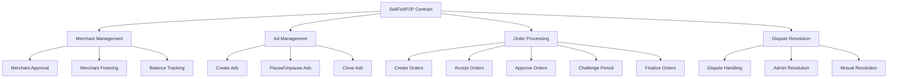
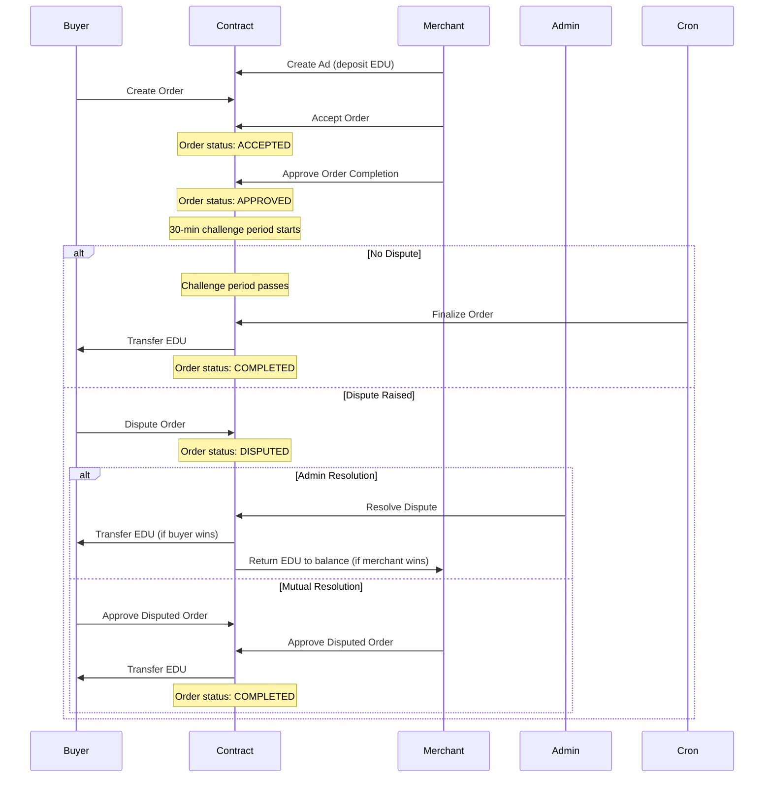

# SailFishP2P Smart Contract

A P2P escrow smart contract for EDU token trading on EDUCHAIN, enabling merchants to create ads to sell EDU tokens for fiat currencies.

## Overview

SailFishP2P is a decentralized escrow service built for the EDUCHAIN network. It facilitates peer-to-peer transactions between merchants (sellers) and users (buyers), where merchants can create ads to sell EDU (the native token of EDUCHAIN) in exchange for fiat currencies.

The contract provides a secure and transparent way to handle the escrow process, with features for merchant verification, ad management, order processing, and dispute resolution.

## Architecture

### Main Components



### Data Structures

The contract uses the following key data structures:

1. **Merchant**
   ```solidity
   struct Merchant {
       bool isApproved;
       bool isFrozen;
       uint256 totalBalance;
   }
   ```

2. **Ad**
   ```solidity
   struct Ad {
       uint256 id;
       address merchant;
       bool isSellAd;
       uint256 rate;
       uint256 amount;
       uint256 minAmount;
       uint256 maxAmount;
       string fiatCurrency;
       bool isActive;
       bool isPaused;
       uint256 remainingBalance;
   }
   ```

3. **Order**
   ```solidity
   struct Order {
       uint256 id;
       uint256 adId;
       address buyer;
       uint256 amount;
       OrderStatus status;
       uint256 approvalTimestamp;
       bool buyerApprovedDispute;
       bool merchantApprovedDispute;
       uint256 timestamp;
   }
   ```

4. **OrderStatus**
   ```solidity
   enum OrderStatus {
       CREATED,
       ACCEPTED,
       APPROVED,
       COMPLETED,
       DISPUTED,
       CANCELLED
   }
   ```

### Order Flow



## Features

### Merchant Management

- Merchants must be approved by an admin before they can create ads
- Merchants can be frozen/unfrozen by the admin
- Each merchant's total EDU balance is tracked

### Ad Management

- Merchants can create sell ads to offer EDU tokens for fiat currency
- Each ad specifies rate, amount, min/max order size, and fiat currency
- Merchants must deposit EDU when creating sell ads
- Ads can be paused or closed by the merchant

### Order Processing

- Users can create orders against active ads
- Merchants must accept orders before processing
- When an order is accepted, the funds are set aside from the ad's balance
- Merchants approve order completion, starting a 30-minute challenge period
- If not disputed, orders can be finalized after the challenge period

### Dispute Resolution

- Users can dispute orders during the 30-minute challenge period
- Disputes can be resolved by admin intervention
- Disputes can also be resolved if both parties approve the transaction again

### Batch Processing

- Multiple expired orders can be finalized in a single transaction
- Approved orders are tracked in an array for efficient processing by cron jobs

## Security Features

- Strict access control for admin and merchant functions
- Admin transfer functionality for multisig wallet setup
- Merchant freezing prevents:
  - Creating new ads
  - Closing existing ads
  - Sending EDU to the contract
  - Users creating orders for frozen merchants' ads
- Balance verification before accepting orders
- Reentrancy protection for all fund transfers
- Secure handling of native EDU token
- Challenge period to prevent fraudulent transactions

## Events

The contract emits events for all key actions, including:

- Merchant approval and freezing
- Ad creation, pausing, and closing
- Order creation, acceptance, approval, and completion
- Dispute raising and resolution
- EDU deposits and withdrawals

## Networks

The contract can be deployed on:

- **EDUCHAIN Mainnet**
  - ChainID: 41923
  - RPC URL: https://rpc.edu-chain.raas.gelato.cloud

- **Open Campus Testnet**
  - ChainID: 656476
  - RPC URL: https://rpc.open-campus-codex.gelato.digital/

## Development

### Prerequisites

- Node.js and npm
- Hardhat

### Installation

```bash
npm install
```

### Testing

```bash
npx hardhat test
```

### Deployment

```bash
npx hardhat run scripts/deploy.js --network opencampus
```

## License

MIT
